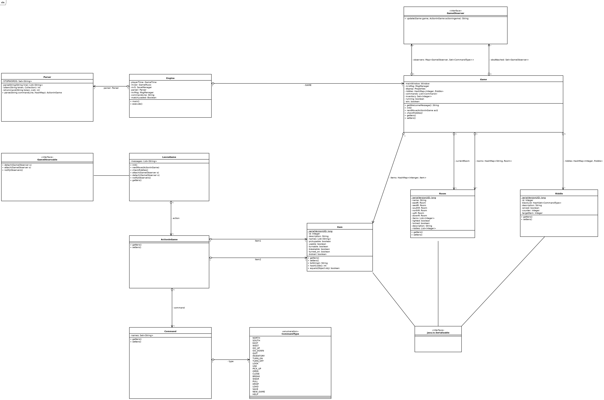

# Progetto Leone - MAP

## INDICE
- [Introduzione](#introduzione)
- [Diagramma delle Classi](#diagramma-delle-classi)
- [Specifiche Algebriche](#specifiche-algebriche)
- [Applicazione Argomenti del Corso](#applicazione-argomenti-del-corso)
- [Guida al Gioco](#guida-al-gioco)

## INTRODUZIONE

### Team

Il team che ha lavorato sul progetto è composto da:
- Federisco Troisi
- Domenico Tinelli
- Anna Maffione

### Descrizione

Questo progetto, realizzato in occasione dell'esame di Metodi Avanzati di Programmazione, è un'avventura testuale basata sul personaggio iconico della serie animata Leone il Cane Fifone.

### Trama

Giustino ha acquistato una casa super moderna dotata di intelligenza artificiale. Tuttavia, Giustino perde il controllo su di essa, finendo per essere espulso dalla casa e lasciando Leone e Marilù in preda alla casa imbizzarrita. 
Sarà compito di Leone risolvere i vari enigmi a cui sarà sottoposto per disattivare una volta per tutte la casa e mettere fine a questo disastro. 

## DIAGRAMMA DELLE CLASSI

## DESCRIZIONE CLASSI

## SaveManager

La classe 'SaveManager' si occupa di gestire il salavataggio, caricamento e creazione di una partita, interfacciandosi con un server, qualora lo si voglia, per il backup e recupero dei dati.

I metodi principali della classe sono newGame, loadMatch e saveMatch, che permettono la gestione dei dati in locale.
Il metodo connectToServer permette di connettersi al server, attraverso operazioni di login o signin.
Se connessi sarà possibile effettare il backup delle partite in locale, o ripristinare salvataggi dal server, qualora presenti, nonchè avere accesso alla classifica globale dei giocatori.

Al player sarà possibile avere contemporaneamente salvate 3 partite, qualora non terminate.

## Server

La classe 'Server' simula il lato server del progetto. Si occupa di gestire molteplici socket, avviando un thread per ciascuno dei client connessi affinché sia possibile gestirli contemporaneamente.

Il server salva su database le informazioni riguardanti l'utente, username e password, per poi accedervi per effettuare i controlli di validità di username e correttezza password. L'accesso al database è controllato, un solo thread per volta può accedervi per effettuare le ricerche.

Il metodo run gestisce completamente le richieste dell'utente, permettendo l'accesso ai dati salvati, attraverso login, o la registrazione se non vi si è mai interfacciati.
Poi effettua operazioni di backup, ripristino, aggiunta del player alla classifica globale e accesso alla classifica.

Ad ogni player corrisponde una directory con 3 partite salvabili contemporaneamente.

## Engine

La classe 'Engine' permette di rendere riutilizzabile parte del programma, permettendo di poter sviluppare altre avventure testuali, purché abbiano stessa struttura implementativa, e poterle avviare con pochi accorgimenti.
La struttura implementativa è definita dalla classe astratta Game.

## Game

Game è una classe astratta, contenente gli attributi e i metodi necessari per la corretta costruzione ed esecuzione del gioco secondo lo schema scelto.
Tra gli attributi principali di Game abbiamo quelli responsabili della comunicazione con l'utente, mainWindow e mrMsg, che rispettivamente implementano la gui e permettono le operazioni di in/out; poi gli attributi per la gestione degli observers, obsAttached e observers; le strutture dati per contenere i componenti del gioco, items, riddles, rooms, commands, inventory; poi altri attributi secondari, necessari per controllare il flusso di esecuzione del gioco e gestire il tempo di partita.
Tra i metodi invece abbiamo nextMove, aggiorna il gioco basandosi sull'output del parser; checkRiddle, che verifica la presenza di indovinelli non risolti; init, che inizializza il gioco. L'implementazione di questi metodi è lasciata alle classi che estondono questa.

## LeoneGame

La classe 'LeoneGame' estende la classe astratta Game.
LeoneGame implementa i metodi principali di Game.
Attraverso init inizializziamo tutte le componenti principali del gioco, come Item, Riddle, Commands, Observers, etc, attraverso accessi a database contenenti le componenti.
Con nextMove riceviamo l'output del parser e aggiorniamo lo stato del gioco sulla base dell'azione eseguita, coordinando gli observer collegati.
checkRiddle invece è necessario per vedre se vi sono indovinelli nella stanza attuale da risolvere, e in tal caso scollegare gli observer che si occupano di eseguire l'azione, rendendo vano il comanod dell'utente e ricevendo una spiegazione sul perché non viene eseguito.

## Parser

Il parser ci permette di ricavare dall'input dell'utente una azione, ActionInGame, che si suddivide in comando, item1 e item2.
Il metodo parse suddivide in token l'input ricevuto, e una volta eliminato le stopwords, inizializzate con la creazione del parser e contenute in un file apposito, verifica la struttura del comando, vedendo se è un comando diretto, un azione con un oggetto o un azione con 2 oggetti. Sulla base di questa informazione costruisce l'output ActionInGame, che verrà mandato al nextMove implementato dalla classe che erediterà da Game.

## Item

La classe 'Item' rappresenta gli oggetti presenti nell'avventura testuale, dotati di attributi per indicare come il giocatore può effettivamente interagire con essi. Ad esempio, pickupable indica che l'oggetto è raccoglibile, turnable che si può accendere e così via. È inoltre dotato di una descrizione da mostrare al giocatore e di una lista di alias, nonché sinonimi per riferirsi ad esso.  

## Room

La classe 'Room' rappresenta le stanze attraverso le quali il giocatore può muoversi. Sono dotate di attributi per tenere traccia delle stanze presenti nelle quattro direzioni ovest, est, sud e nord rispetto ad essa, ed eventualmente anche di una stanza ad un piano superiore o inferiore. 

È presente una lista per contenere gli oggetti presenti nella stanza con cui il giocatore può interagire.
È inoltre presente una lista di indovinelli a cui il giocatore verrà sottoposto. 

Anche qui abbiamo attributi che influenzano la maniera in cui l'utente può interagire con l'ambiente, come "lighted" e "locked" che indicano rispettivamente se la stanza è illuminata o bloccata. 

## Riddle

La classe 'Riddle' rappresenta gli indovinelli a cui il giocatore sarà sottoposto nel momento in cui si trova in una determinata stanza del gioco. 

È ovviamente dotata di una descrizione da mostrare al giocatore e di un attributo 'targetItem' che indica l'oggetto che fa attivare l'enigma. L'attributo 'counter' invece indica quante volte si è tentato di risolvere l'enigma, così come la 'blackList' indica l'elenco di comandi disattivati come conseguenza della presenza dell'enigma. 

## Command & CommandType

La classe 'Command' rappresenta i comandi impartibili dall'utente. È dotata semplicemente di un insieme di nomi, 'names', per riferirsi ad un determinato comando ed è strettamente legata alla classe enumerativa 'CommandType' in quando possiede un attributo 'type' proprio di quel tipo, necessario per identificare il comando in maniera indipendente dal nome adoperato dal giocatore.

## SPECIFICHE ALGEBRICHE

### Lista

La lista è una struttura dati che permette di contenere dati e muoversi tra di essi sfruttando l'indice di posizione associato. 

### Specifica Sintattica

### Tipi e Operatori

<pre>
+-------------------------------------------------------------------------------------------+
|                                          Tipi                                             |
+-------------------------------------------------------------------------------------------+
|List, Item, Integer, Boolean                                                               |
+-------------------------------------------------------------------------------------------+
|                                       Operatori                                           |
+--------------------------------------------------+----------------------------------------+
| newList() -> List                                | Crea una nuova lista vuota             |
+--------------------------------------------------+----------------------------------------+
| add(List, Item, Integer) -> List                 | Aggiunge un elemento alla lista nella  |
|                                                  | posizione specificata                  |
+--------------------------------------------------+----------------------------------------+
| isEmpty(List) -> Boolean                         | Restituisce true se la lista è vuota   |
|                                                  | altrimenti false                       |
+--------------------------------------------------+----------------------------------------+
| size(List) -> Integer                            | Restituisce l'ultima posizione occupata|
|                                                  | da un elemento                         |
+--------------------------------------------------+----------------------------------------+
| getIndex(List, Item) -> Integer                  | Restituisce la posizione dell'elemento |
|                                                  | specificato                            |
+--------------------------------------------------+----------------------------------------+
| getItem(List, Integer) -> Item                   | Restituisce l'elemento nella posizione |
|                                                  | specificata                            |
+--------------------------------------------------+----------------------------------------+
| remove(List, Integer) -> List                    | Rimuove dalla lista l'elemento nella   |
|                                                  | posizione specificata                  |
+--------------------------------------------------+----------------------------------------+
| contains(List, Item) -> Boolean                  | Restituisce true se l'elemento         |
|                                                  | specificato è contenuto nella lista    |
+--------------------------------------------------+----------------------------------------+
</pre>

### Osservazioni e Costruttori

<pre>
+-----------------------------------------------------------------------------------------------+
|                                  Costruttori di l'                                            |
+--------------------------+-------------------+------------------------------------------------+
|          Osservazioni    |    newList        |                   add(l, it, id)               | 
+--------------------------+-------------------+------------------------------------------------+
| isEmpty(l')              |      true         |                       false                    |
+--------------------------+-------------------+------------------------------------------------+
| size(l')                 |      error        | if isEmpty(l) then 1 else getLastIndex(l) + 1  |
+--------------------------+-------------------+------------------------------------------------+
| getIndex(l', it')        |      error        | if it = it' then id else getIndex(l, it')      |
+--------------------------+-------------------+------------------------------------------------+
| getItem(l', id')         |      error        | if id = id' then it else getItem(l, id')       |
+--------------------------+-------------------+------------------------------------------------+
| remove(l', id')          |      error        | if id = id' then l else add(remove(l, id'), it)|
+--------------------------+-------------------+------------------------------------------------+
| contains(l', it')        |      false        | if it = it' then true else contains(l, it')    |
+--------------------------+-------------------+------------------------------------------------+
</pre>

### SPECIFICA SEMANTICA
**DECLARE**
<pre>
- l, l'   : List
- it, it' : Item
- id, id' : Integer
</pre>

### Operazioni

<pre>
- isEmpty(newList)                      = true
- isEmpty(add(l, it, id))               = false
- getLastIndex(add(l, it, id))          = if isEmpty(l) then 1 else getLastIndex(l) + 1
- getIndex(add(l, it, id), it')         = if it = it' then id else getIndex(l, it')
- getItem(add(l, it, id), id')          = if id = id' then it else getItem(l, id')
- remove(add(l, it, id), id')           = if id = id' then l else add(remove(l, id'), it)
- contains(newList, it')                = false
- contains(add(l, it, id), it')         = if it = it' then true else contains(l, it')
</pre>

### Specifica di restrizione
### Restrizioni

<pre>
- getLastIndex(newList)   = error
- getIndex(newList, it')  = error
- getItem(newList, id')   = error
- remove(newList, id')    = error
</pre>

### Mappa

La mappa è una struttura dati che associa una chiave ad un valore, permettendo di memorizzare e recuperare informazioni in modo efficiente.

### Specifica sintattica

<pre>
+----------------------------------------------------------------------------------------+
|                                       Tipi                                             |
+----------------------------------------------------------------------------------------+
| Map, Key, Value, Boolean, Integer                                                      |
+----------------------------------------------------------------------------------------+
|                                     Operatori                                          |
+----------------------------------------------------------------------------------------+
| newMap() -> Map                        | Crea una nuova mappa vuota                    |
+----------------------------------------+-----------------------------------------------+
| isEmpty(Map) -> Boolean                | Restituisce true se la mappa è vuota,         |
|                                        | false altrimenti                              |
+----------------------------------------+-----------------------------------------------+
| put(Map, Key, Value) -> Map            | Aggiunge una coppia chiave-valore alla mappa, |
|                                        | o, se già presente, ne aggiorna il valore     |
+----------------------------------------+-----------------------------------------------+
| get(Map, Key) -> Value                 | Restituisce il valore associato alla chiave   |
|                                        | specificata                                   |
+----------------------------------------+-----------------------------------------------+
| containsKey(Map, Key) -> Boolean       | Restituisce true se la chiave specificata è   |
|                                        | presente nella mappa                          |
+----------------------------------------+-----------------------------------------------+
| containsValue(Map, Value) -> Boolean   | Restituisce true se il valore specificato è   |
|                                        | presente nella mappa                          |
+----------------------------------------+-----------------------------------------------+
| remove(Map, Key) -> Map                | Rimuove la chiave ed il valore associato      |
|                                        | ad essa dalla mappa                           |
+----------------------------------------+-----------------------------------------------+
| size(Map) -> Integer                   | Restituisce il numero di coppie chiave-valore |
|                                        | presenti nella mappa                          |
+----------------------------------------+-----------------------------------------------+
</pre>

### Osservazioni e Costruttori

<pre>
+---------------------------------------------------------------------------------------------+
|                                   Costruttori di m'                                         |
+-------------------------------------------- +-----------------------------------------------+
| Osservazioni         | newMap               |              put(m, k, v)                     |
+---------------------------------------------+-----------------------------------------------+
| isEmpty(m')          | true                 |              false                            |
+---------------------------------------------+-----------------------------------------------+
| get(m', k')          | error                | if k = k' then v else get(m, k')              |
+---------------------------------------------+-----------------------------------------------+ 
| containsKey(m', k')  | false                | if k = k' then true else containsKey(m, k')   |
+---------------------------------------------+-----------------------------------------------+
| containsValue(m', v')| false                | if v = v' then true else containsValue(m, v') |
+---------------------------------------------+-----------------------------------------------+
| remove(m', k')       | error                | if k = k' then m else put(remove(m, k'), k, v)|
+---------------------------------------------+-----------------------------------------------+
| size(m')             | 0                    | if isEmpty(m) then 1 else size(m) + 1         |
+---------------------------------------------+-----------------------------------------------+
</pre>

### Specifica semantica

**DECLARE**

<pre>
- m, m'   : Map
- k, k'   : Key
- v, v'   : Value
</pre>

### Operazioni

<pre>
- isEmpty(newMap)                      = true
- isEmpty(put(m, k, v))                = false
- containsKey(newMap, k')              = false
- containsKey(put(m, k, v), k')        = if k = k' then true else containsKey(m, k')
- containsValue(newMap, v')            = false
- containsValue(put(m, k, v), v')      = if v = v' then true else containsValue(m, v')
- get(put(m, k, v), k')                = if k = k' then v else get(m, k')
- remove(put(m, k, v), k')             = if k = k' then m else put(remove(m, k'), k, v)
- size(newMap)                         = 0
- size(put(m, k, v))                   = size(m) + 1
</pre>

### Specifica di restrizione
### Restrizioni
<pre>
- get(newMap, k')    = error
- remove(newMap, k') = error
</pre>

## APPLICAZIONE ARGOMENTI DEL CORSO

### FILE

All'interno del nostro progetto, i file sono stati utilizzati principalmente in tre casi:
1) Creare dei salvataggi della partita
2) Creare un file "stopwords" per il parser
3) Creare un file "ranking", cioè una classifica

Per quanto riguarda i salvataggi della partita, nel momento in cui si avvia il gioco, viene immediatamente chiesto al giocatore se vuole iniziare una nuova partita o caricare dei salvataggi già esistenti. Inoltre, nel momento in cui si esce dal gioco con l'apposito comando "esci", viene chiesto se si desidera salvare. In caso di risposta affermativa, verrà creato un file di salvataggio nella cartella relativa all'utente, in caso avesse fatto un login/signin. 

Per quanto riguarda i file "stopwords", esso contiene delle parole, banalmente proposizioni ed articoli, che il parser deve ignorare nel riconoscimento del comando impartito dall'utente. 

Per quanto riguarda il file "ranking", si tratta di una classifica ordinata in base ai giocatori che hanno impiegato il minor tempo per completare il gioco

Nel caso dei salvataggi e del ranking sono stati usati file serializzati con estensione .ser, per avere una corrispondenza con gli oggetti effettivamente implementati nel progetto. Nel caso del file "stopwords" invece, è stato usato un semplice .txt 

### DATABASE

All'interno del nostro progetto, i database sono stati usati per avere tutti gli oggetti utilizzati all'interno del gioco sottoforma di "tabelle" riempite comodamente tramite comandi SQL. Infatti, nel momento in cui viene avviata una nuova partita, vengono inizializzati tutti gli oggetti tramite i valori precedentemente inseriti nei rispettivi database. 

Abbiamo quindi creato 4 file di database che corrispondono ai 4 oggetti alla base del nostro progetto, nonché:
1) Un database dedicato ai commands, ovvero ai comandi che il giocatore può impartire
2) Un database dedicato agli item, ovvero gli oggetti contenuti nelle varie stanze o eventualmente nell'inventario del giocatore
3) Un database dedicato ai riddles, ovvero agli enigmi presenti in determinate stanze del gioco
4) un database dedicato alle rooms, ovvero alle stanze di cui la mappa del nostro gioco è composto

### THREAD

All'interno del nostro progetto, i thread sono stati utilizzati per:
1) Musica
2) Cronometro
3) Server (Socket)

Nel caso della musica, è stata realizzata una classe GameMusic che implementa Runnable, in modo da avere un thread che controlla l'esecuzione del file audio utilizzato come musica di background per il nostro gioco, che si avvia nel momento in cui viene avviata una nuova partita e si ferma nel momento in cui si completa o si abbandona il gioco. 

Nel caso del cronometro, è stata realizzata una classe GameTime che implementa Runnable, in modo da avere un thread che fa partire il conteggio del tempo nel momento in cui viene avviata una nuova partita, per fermarlo nel momento in cui la partita termina o il giocatore abbandona il gioco. 

Nel caso del Socket, è stata creata una classe Server contenente una classe UserThread che estende Thread, in modo da gestire accuratamente il signin e il login dell'utente. Infatti, nel momento in cui viene avviata una nuova partita e si decide di collegarsi al server, viene chiesto al giocatore di effettuare il login oppure un signin (ovvero una prima registrazione per utenti nuovi) e ogni UserThread gestirà il proprio user collegato, indipendentemente dagli altri UserThread.

### Socket

All'interno del nostro progetto, i socket sono stati utilizzati per realizzare la classe Server, collocata in un package diverso da quello utilizzato per il resto del progetto (ovvero di.uniba.leone.*nome_package*). Infatti, se si desidera sfruttare le implementazioni relative ai server del nostro gioco, questa classe dev'essere avviata precedentemente all'avvio dell'Engine di gioco, in quanto fa partire un collegamento a server su porta 6666 per gestire login, signin e backup e caricamento di salvataggi, come spiegato precedentemente nella sezione [Server](#server).

### Swing

All'interno del nostro progetto sono state usate le Java Swing per creare una GUI, ovvero un'interfaccia grafica per il nostro gioco. 

Abbiamo implementato due classi nel package gui, ovvero Window e MsgManager. Window è quella in cui sono state impostate tutte le accortezze grafiche della nostra GUI, infatti essa estende JFrame e contiene a sua volta una classe BackgroundPanel che invece estende JPanel. L'oggetto mainPanel implementa BackgroundPanel con l'immagine da noi scelta come sfondo e al di sopra del BackgroundPanel vi è posto il centerPanel contenente i componenti necessari per gestire input e output. 

Infatti, tramite la nostra GUI gestiamo completamente le operazioni di input e output, bypassando il terminale che viene utilizzato solo per stampare eventuali messaggi d'errore necessari unicamente allo sviluppatore. 

### Lambda

All'interno del nostro progetto sono state usate le Lambda Expression per compattare, laddove possibile, blocchi di codice, la cui implementazione sarebbe altrimenti stata più complessa e di difficile interpretazione. 

Abbiamo inoltre utilizzato le Lambda Expression per implementare l'action che verrà poi associata all'input field e all'enter button, per permettere la lettura dell'input dalla GUI.

## GUIDA AL GIOCO

Abbiamo pensato di realizzare un walkthrough per rendere più facile esplorare il nostro gioco senza impegnarsi troppo nella risoluzione degli enigmi, o anche banalmente per capire come risolverne uno dopo essersi bloccati. 

L'abbiamo appositamente caricato su YouTube, eccone il link:

https://youtu.be/IXKkh2-nxrA